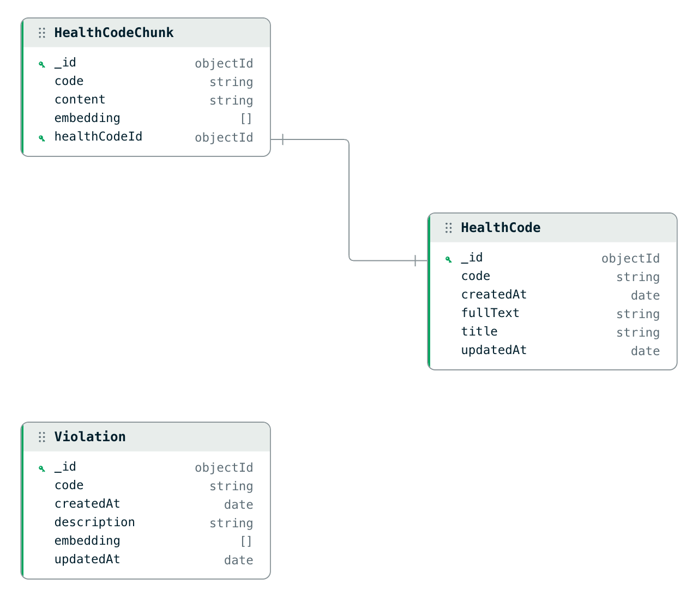

# Challenge B: NYC Restaurant Inspection Assistant

## Overview

A tool designed to flag discrepancies between NYC restaurant inspection violation descriptions and the actual Health Code.
The system parses inspection data (CSV) and the Health Code (PDF), stores them in MongoDB, and uses vector search/semantic similarity to verify if cited violations actually exist in the current code.

## Roadmap & Status

### ✅ Completed

- [x] **Database Schema**: Designed schema to store PDF/CSV data and support vector-based semantic search. The structure also enables understanding the context of discrepancies and easily presenting it to the user.
- [x] **Data Ingestion**: Parsing `health_code.pdf` and `inspections.csv`.
- [x] **Infrastructure**: MongoDB Replica Set (Docker), Prisma setup.
- [x] **Embeddings**: Generating vector embeddings for Health Code text chunks and Violations.

### 🚧 To Do

- [ ] **Vector Search**: Implement MongoDB Atlas Vector Search compatibility.
- [ ] **Analysis Engine**: Logic to find violations with lowest similarity scores against the Health Code.
- [ ] **Persistence**: Store analysis results (flagged violations) in the database.
- [ ] **API**: Endpoints to retrieve flagged violations.
- [ ] **Automation**: Triggers to re-calculate discrepancies when data is updated.

### 🔮 Future Improvements

- [ ] **Performance**: Implement necessary indexes along with performance tests.
- [ ] **Resilience**: Robust validation for corrupt/incomplete PDF or CSV files.
- [ ] **Testing**: Comprehensive unit tests for `health-code-parsing.service.ts`.
- [ ] **Optimization**: Stream-based ingestion to reduce RAM usage (process in chunks).

## Technical Approach

We use **Semantic Search** to bridge the gap between informal violation descriptions (e.g., "Raw shellfish stored improperly") and formal legal text.

1. **Ingestion**: Parse Health Code -> Generate Embeddings.
2. **Analysis**: Violation Description -> Embedding -> Vector Search.
3. **Result**: Low similarity score = Potential discrepancy.

## Database Schema



## Prerequisites

- **Node.js** (v20+)
- **Docker & Docker Compose** (for MongoDB Replica Set)
- **pnpm** (Package Manager)

## Setup

1.  **Start Database**

    Starts a MongoDB instance configured as a Replica Set (required for Prisma MongoDB provider).

    ```bash
    docker compose up -d
    ```

2.  **Install Dependencies**

    ```bash
    pnpm install
    ```

3.  **Generate Database Client**

    Run this after installing dependencies or whenever `prisma/schema.prisma` changes.

    ```bash
    npx prisma generate
    ```

4.  **Setup Environment**

    Ensure `.env` contains your MongoDB connection string.
    Example in `.env.dist`:

    ```bash
    DATABASE_URL="mongodb://localhost:27017/nyc_inspector?replicaSet=rs0"
    ```

## Data Ingestion

Before analyzing violations, you must populate the database with the Health Code and Inspection data.

1.  **Prepare Data Files**
    Place the following files in the `data/` directory (create it if it doesn't exist):
    - `health_code.pdf`: [ARTICLE 81 FOOD PREPARATION AND FOOD ESTABLISHMENTS](https://www.nyc.gov/assets/doh/downloads/pdf/about/healthcode/health-code-article81.pdf)
    - `inspections.csv`: [DOHMH New York City Restaurant Inspection Results](https://data.cityofnewyork.us/Health/DOHMH-New-York-City-Restaurant-Inspection-Results/43nn-pn8j/about_data)

2.  **Run Ingestion Command**

    This command parses the PDF to extract health code articles and their embeddings, and ingests unique violation descriptions from the CSV.

    ```bash
    pnpm run load-data
    ```

3.  **Verify Data**
    You can use [MongoDB Compass](https://www.mongodb.com/products/tools/compass) to connect to `mongodb://localhost:27017/nyc_inspector` and check that the `HealthCode` and `Violation` collections are populated.

## Running the Application

Once data is loaded, you can run the main application.

```bash
# development mode
pnpm run start

# watch mode
pnpm run start:dev
```

## Project Structure

- `src/data-ingestion/`: Core logic for parsing and loading data.
  - `health-code-ingestion.service.ts`: Handles PDF parsing and embedding generation.
  - `violation-ingestion.service.ts`: Handles CSV processing for inspection violations.
  - `feature-extraction.service.ts`: Utility for generating text embeddings (using Transformers.js).
- `src/command.ts`: Entry point for CLI commands (like `load-data`).
- `prisma/`: Database schema and configuration.
- `data/`: Local directory for input files (`health_code.pdf`, `inspections.csv`).
